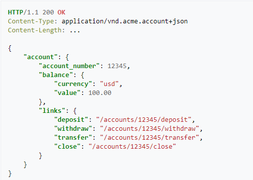
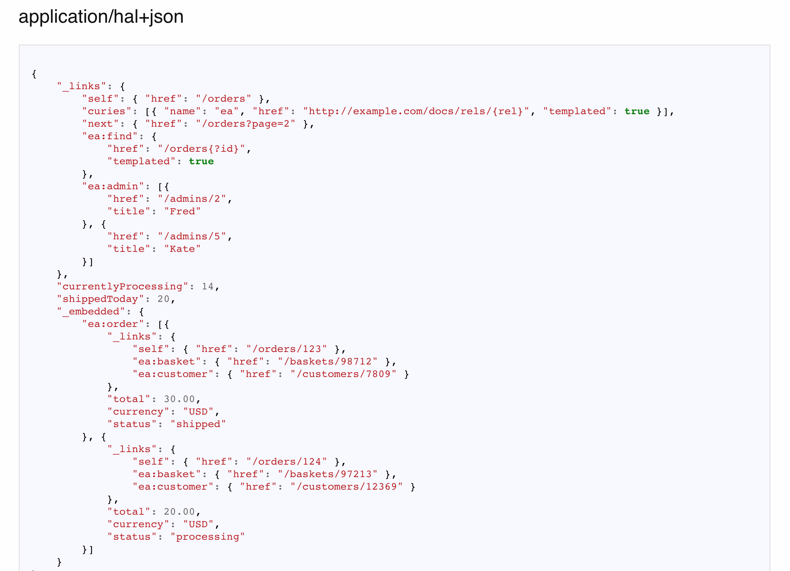

# Comunicação entre sistemas - REST e níveis de maturidade
- Muitos desenvolvedores já sabem trabalhar com REST
- Representational state of transfer. (Estado representacional de transferência)
- Surgiu em 2000 por Roy Fielding em uma dissertação de doutorado
- Simplicidade
- Stateless
- Cacheável

## REST: Níveis de maturidade (Richardson Maturity Model)
### Nível 0: The Swamp of POX
- Não possui padrão para comunição.

### Nível 1: Utilização de resources
- Há um padrão, metodos e verbos porem, nao utilizado corretamente
    | VERBO  | URI         | OPERACOES |
    | ------ | ----------- | --------- |
    | GET    | /products/1 | buscar    |
    | POST   | /products   | inserir   |
    | PUT    | /products/1 | alterar   |
    | DELETE | /products/1 | remover   |

### Nível 2: Verbos HTTP utilizados corretamente
    | VERBO  | OPERACOES |
    | ------ | --------- |
    | GET    | buscar    |
    | POST   | inserir   |
    | PUT    | alterar   |
    | DELETE | remover   |

### Nível 3: HATEOAS: Hypermedia as the Engine of Application State
- Quando utilizamos corretamente as Resquests e Responses.
Nesse nivel, configuramos o header para dizer o que a API pode receber e retornar.

- No response é enviado alem do solicitado, links que podem ser acessados a partir daquele ponto...

## REST: Uma boa API REST
- Utiliza URIs únicas para servicos e itens que ficam expostos para esses servicos.
- Utliza todos os verbos HTTP para realizar as operacoes em seus recursos, incluindo caching.
- Provê links relacionais para os recursos exemplificando o que pode ser feito.

## Padrões para criacao de API REST: HAL, Collection+JSON e Siren
- JSON não provê um padrão de hipermidia para realizar a linkagem
- HAL: Hypermedia Application Language
- Siren

### REST HAL
- Media type = application/hal+json

# REST: HTTP Method Negotiation
HTTP possui um outro método: OPTIONS. Esse método nos permite informar quais métodos são permitidos ou não em determinado recurso.

**OPTIONS /api/product HTTP/1.1**
**Host: http://localhost**

Respose:

**HTTP/1.1 200 OK**
**Allow: GET, POST**

Caso envie a requisicao em outro formato:

**HTTP/1.1 405 Not Allowed**
**Allow: GET, POST**

# REST: Content Negotiation
O processo de content negotiation é baseado na requisicao que o client está fazendo para o server. Nesse caso ele solicita o que e como ele quer a resposta. O server então retornará ou não a informação no formato desejado.

**Accept Negotiation**
- Client solicita a informacao e o tipo de retorno pelo server baseado no media type informado por ordem de prioridade.

- **GET/product**
- **Accept: application/json**

Resposta pode ser o retorno dos dados ou:

**HTTP/1.1 406 Not Acceptable**

# REST: Content-type negotiation
**Content-Type Negotiation**

- Através de um content-type no header da request, o servidor consegue verificar se ele irá conseguir processar a informacao para retornar a informacao desejada.

**POST /product HTTP/1.1**
**Accept: application/json**
**Content-Type: application/json

**{**
    **"name": "product"**
**}**

Caso o servidor nao aceite o content type, ele poderá retornar:

**HTTP/1.1 415 Unsupported Media Type**
